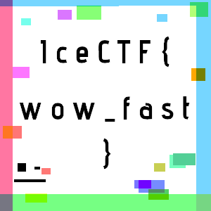

# Forensics

## Modern Picasso(150 points)

Here's a rendition of some modern digital abstract art. Is it more than art though?

[picasso.gif](picasso.gif)

## Write-up

I extracted all the frames of gif. I got 67 png images. In every images i see that some small fragments of a character which may together form flag for this challenge. So i use `Stegsolve` tool to combine all images to get a single image. Finally i found final image which contains flag for this challenge.

 

## flag:IceCTF{wow_fast}
